# System Workflow Visualization

## LangGraph Workflow Diagram (Mermaid)

## Data Flow Diagram

```mermaid
graph LR
    Input[📁 input_files/<br/>CSV & JSON] --> Meta[📊 Metadata<br/>Extractor]
    Meta --> Prof[🔍 Profiler<br/>Dependencies]
    Prof --> Keys[🔑 Key<br/>Detector]
    Keys --> Norm[⚙️ Normalizer<br/>3NF Engine]
    Norm --> SQL[📝 SQL<br/>Generator]
    SQL --> Out1[📄 normalized_output/]
    SQL --> Out2[💾 sql_output/]
    SQL --> Out3[🎨 erd/]
    
    style Input fill:#E6F3FF
    style Meta fill:#FFE6E6
    style Prof fill:#E6FFE6
    style Keys fill:#FFF4E6
    style Norm fill:#F0E6FF
    style SQL fill:#FFE6F0
    style Out1 fill:#90EE90
    style Out2 fill:#90EE90
    style Out3 fill:#90EE90
```

## Normalization Process

## Foreign Key Detection Algorithm

```mermaid
graph TD
    Start[Analyze Table Pair] --> NameSim[Calculate<br/>Name Similarity]
    NameSim --> ValOverlap[Calculate<br/>Value Overlap]
    ValOverlap --> Cardinality[Detect<br/>Cardinality Pattern]
    Cardinality --> CheckPK{Referenced<br/>Column is PK?}
    
    CheckPK -->|Yes| HighScore[Score += 20]
    CheckPK -->|No| LowScore[Score += 0]
    
    HighScore --> CheckSim{Name Sim<br/>> 0.9?}
    LowScore --> CheckSim
    
    CheckSim -->|Yes| AddSim[Score += 40]
    CheckSim -->|No| AddSim2[Score += 10]
    
    AddSim --> CheckOverlap{Value Overlap<br/>> 0.8?}
    AddSim2 --> CheckOverlap
    
    CheckOverlap -->|Yes| AddOverlap[Score += 30]
    CheckOverlap -->|No| AddOverlap2[Score += 10]
    
    AddOverlap --> FinalCheck{Score > 50?}
    AddOverlap2 --> FinalCheck
    
    FinalCheck -->|Yes| FK[✅ Foreign Key<br/>Detected]
    FinalCheck -->|No| NoFK[❌ Not a<br/>Foreign Key]
    
    style Start fill:#E6F3FF
    style FK fill:#90EE90
    style NoFK fill:#FFB6C1
```

## Module Dependencies

## System Architecture

## To view these diagrams:

1. **Copy the Mermaid code** from this file
2. **Paste into** https://mermaid.live/
3. **Or use VS Code** with Mermaid preview extension

---

*These diagrams provide visual representations of the system's workflow, architecture, and algorithms.*
